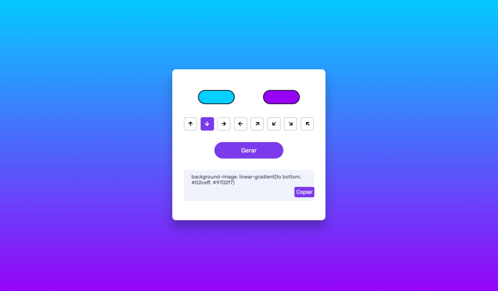

# Gerador de Gradiente (Degradê)

## Sobre o projeto

Um apicativo simples capaz de gerar várias opções de gradiente.

## Como utilizar

Basta modificar as as cores e definir a direção do gradiente, utilizando os botões de seta. Também é possível copiar o gradiente por você.

## Informações

Projeto desenvolvido utilizando apenas HTML, CSS e JavaScript.

